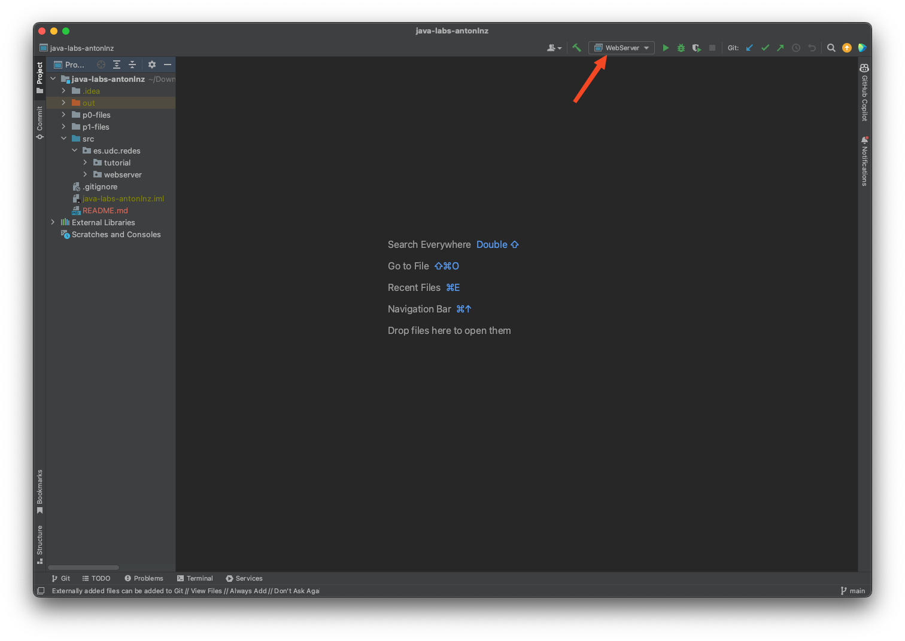
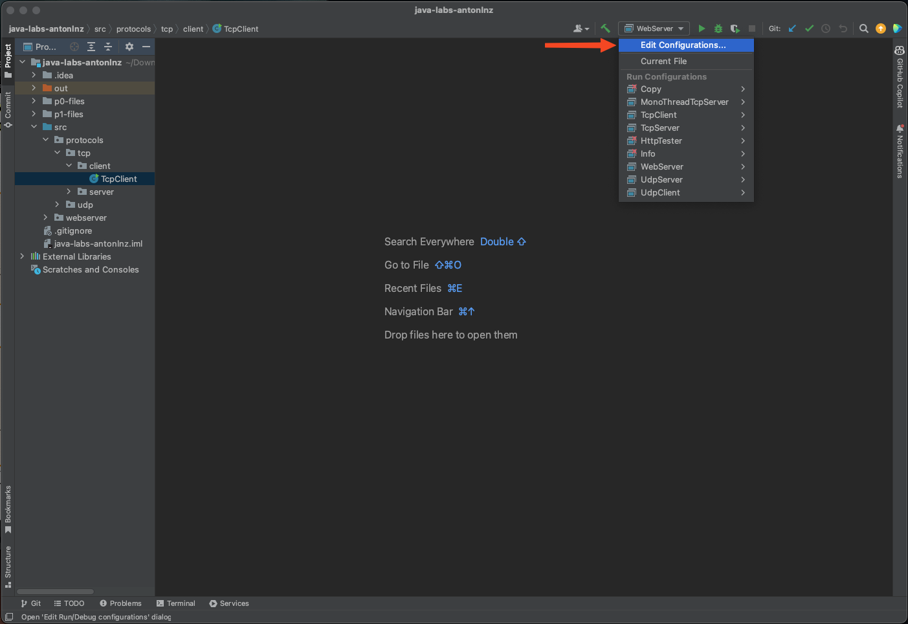
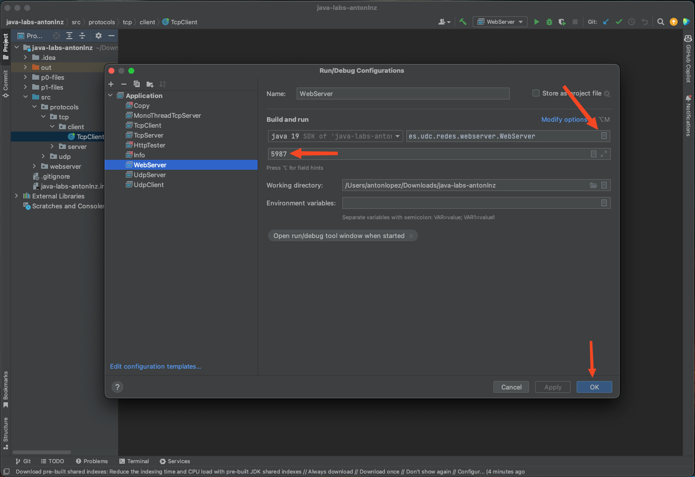
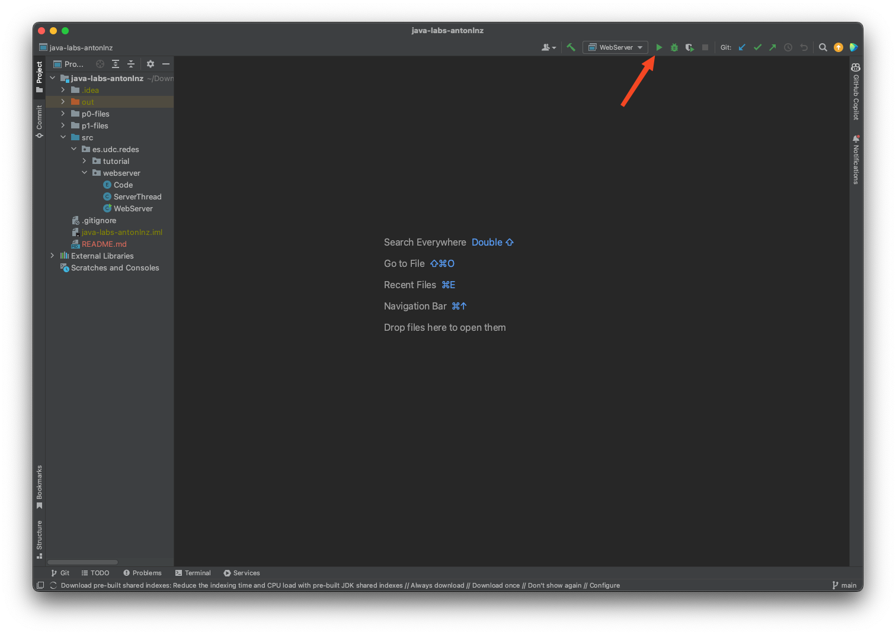
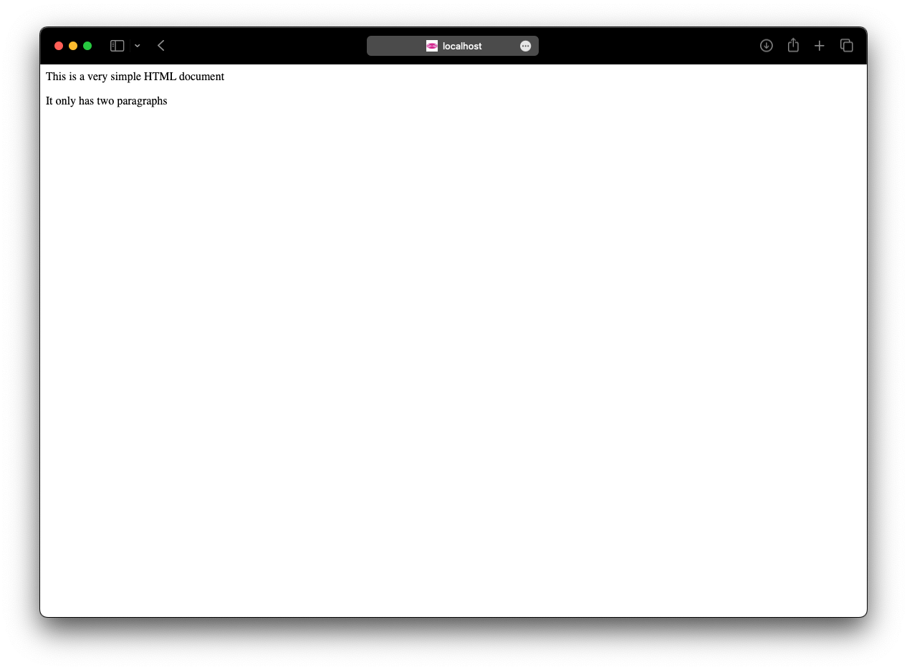

# Web server
This is a simple web-server written in Java that supports GET and HEAD requests.

## Use Instructions
1. Clone the github repository or download a zip file with the source code.

2. Open the project with IntelliJ IDE and click on the "WebServer" drop-down menu.

3. Click on the "Edit Condigurations..." button within the menu.

4. In the "Build and run" section you must choose the "WebServer" class and select a listening port (in my case it is 5987). Finally click on the OK button.

5. To start the server you must click on the play icon button.

That's it, your web server is now listening and ready to receive requests !

Here is a screenshot of a test that I did with a web browser. The adress is: `http://localhost:5987/index.html`. You can change localhost to 127.0.0.1 and if you chose another listening port you must change that as well.

